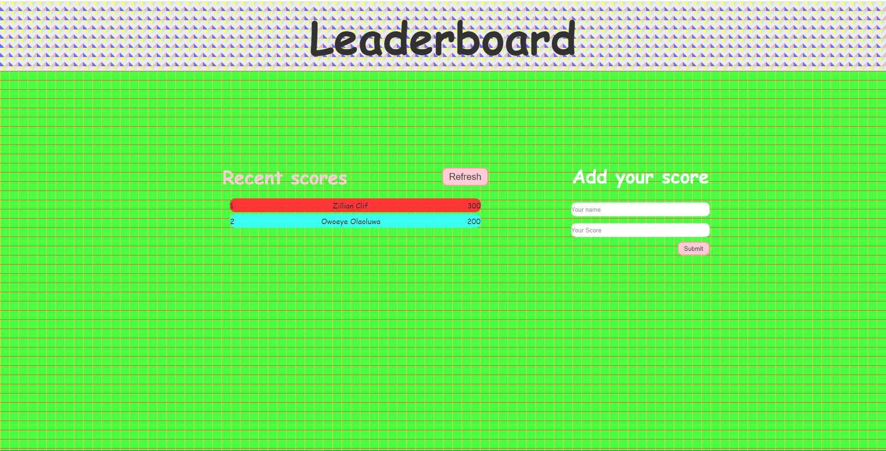
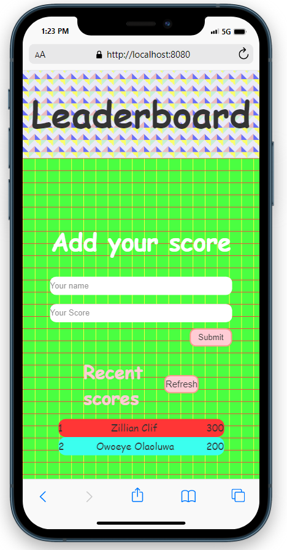

# Leaderboard

## Desktop Version of the Leaderboard

  

## Mobile Version of the site

  

In this project, I am building a Leaderboard to record score with the use of POST and GET from API.

## Built With

- HTML
- CSS
- JavaScript
- Webpack
- API

## Live Demo

[Live Demo Link](https://olamarx.github.io/Leaderboard/dist/)

## Getting Started

To run a local copy of this project follow these simple steps.

### Prerequisites

- Any web browser (e.g. Google Chrome)
- Any Code Editor (e.g. Vscode)

### Cloning the repository

- Create a new folder.
- Open your console in the new folder and run this command: `https://github.com/Olamarx/Leaderboard.git`.
- Open index.html file with your code editor, and run it with a live server extension.
- You're done!

## Authors

👤 **Owoeye Olaoluwa (Olamarx)**

- GitHub: [@githubhandle](https://github.com/Olamarx)
- Twitter: [@twitterhandle](https://twitter.com/Owoeye0laoluwa)
- LinkedIn: [LinkedIn](https://www.linkedin.com/in/olaoluwa-owoeye-617702162/)
- Facebook: [Facebook](https://web.facebook.com/olaoluwa.owoeye.39)

## 🤝 Contributing

Contributions, issues, and feature requests are welcome!

Feel free to check the [issues page](../../issues/).

## Show your support

Give a ⭐️ if you like this project!

## 📝 License

This project is [MIT](./MIT.md) licensed.